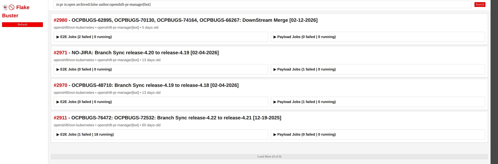

# Flake Buster - PR CI Dashboard

👻🚫 Dashboard for viewing and retesting failed OpenShift PR CI jobs.



## Quick Start

### Local Development

```bash
# Install as package
pip install -e .

# Run dashboard
pr-ci-dashboard --port 5000
```

Then open **http://localhost:5000**

**Custom search:**
```bash
pr-ci-dashboard --search "author:jluhrsen repo:openshift/ovn-kubernetes"
```

### Quick Run (Development)

```bash
curl -fsSL https://raw.githubusercontent.com/jluhrsen/pr-ci-dashboard/main/run.sh | sh
```

**🔒 Security Note:** The [run.sh script](run.sh) downloads this repo to `/tmp` and runs Python locally - no sudo, no permanent changes. Press Ctrl+C to stop and clean up. Review the script before running if concerned.

## Features

- Search PRs using GitHub query syntax
- View failed e2e/payload jobs with consecutive failure counts
- One-click retest via local `gh` CLI
- Auto-polling after retest to detect when jobs start running

## Permafail Detection

The dashboard automatically detects **permafails** - jobs with systematic failure patterns across multiple runs.

### How It Works

1. **Auto-retest logic:**
   - 1st consecutive failure → Auto-retest immediately
   - 2nd consecutive failure → Auto-retest immediately
   - 3rd consecutive failure → Trigger AI analysis

2. **AI analysis:** Uses Claude Code CLI to analyze failure signatures across 3 runs
   - Detects if the same test case fails in all runs
   - Detects if the same infrastructure error occurs in all runs

3. **Visual indicator:** Permafails are marked with a 🗑️🔥 dumpster fire icon
   - Retest button is disabled
   - Warning shows the failure reason

4. **Override:** Right-click a job card → "Clear permafail" to re-enable retesting

### Database

Analysis results are cached in SQLite to avoid redundant AI calls.

**Database location:**
- Default: `~/.local/share/pr-ci-dashboard/dashboard.db`
- Override with `--db-path` CLI option or `PR_CI_DASHBOARD_DB` environment variable

## Prerequisites

### Required for All Use Cases

- **Python 3.11+**
- **GitHub CLI** (`gh`) authenticated - https://cli.github.com
  ```bash
  gh auth login
  gh auth status
  ```

  The `gh` CLI is required for:
  - PR search functionality
  - Job retest operations
  - All script-based operations

### Required for Permafail Analysis

- **Claude Code CLI** installed and available in PATH
- **`ci@ai-helpers` plugin** installed:
  ```bash
  claude plugin marketplace add openshift-eng/ai-helpers
  claude plugin install ci@ai-helpers
  ```
- **Vertex AI credentials** configured:
  ```bash
  export CLAUDE_CODE_USE_VERTEX=1
  export ANTHROPIC_VERTEX_PROJECT_ID=your-gcp-project
  export GOOGLE_APPLICATION_CREDENTIALS=/path/to/sa.json
  ```

  Without these, permafail analysis will be unavailable but other features work normally.

## Using the Dashboard

- **Search bar**: Enter GitHub search syntax, press Enter
- **PR cards**: E2E jobs (left), Payload jobs (right)
- **Expand sections**: Click job headers to show/hide failed jobs
- **Retest**: Click button to trigger `/test` or `/payload-job` comment
  - Button shows "⏳ Retesting..." and polls until job starts running
- **PR links**: Click red PR number to open on GitHub

## Installation & Usage

### Install

```bash
git clone https://github.com/jluhrsen/pr-ci-dashboard.git
cd pr-ci-dashboard
pip install -e .
```

### Run Locally

```bash
# Default search
pr-ci-dashboard --port 5000

# Custom search
pr-ci-dashboard --search "author:jluhrsen repo:openshift/ovn-kubernetes" --port 5000

# Custom database location
pr-ci-dashboard --db-path /custom/path/dashboard.db --port 5000
```

**CLI Options:**
- `--port PORT` - Server port (default: 5000, or `DASHBOARD_PORT` env var)
- `--search QUERY` - Search terms appended to the default query
- `--search-override QUERY` - Completely replace the default search query
- `--db-path PATH` - Database file location (overrides `PR_CI_DASHBOARD_DB` env var)
- `--debug` - Run the Werkzeug dev server with debug mode (development only - never use in production; also `DASHBOARD_DEBUG` env var). Without it, the dashboard runs under gunicorn.
- Positional arguments - legacy form, appended to the search query: `pr-ci-dashboard author:jluhrsen`

**Backward compatibility:**
- Entry point: `python server.py` still works but `pr-ci-dashboard` CLI is preferred
- Positional search terms (`pr-ci-dashboard author:foo`) still append to the query as before
- Module imports: All imports now use `pr_ci_dashboard.*` package prefix
  - Old: `from utils.db import init_db`
  - New: `from pr_ci_dashboard.utils.db import init_db`
- Direct script execution: Use `pr-ci-dashboard` CLI instead of `python -m pr_ci_dashboard.server`

**Default search:** `is:pr is:open archived:false author:openshift-pr-manager[bot]`

## Architecture

- **Backend**: Flask server running bash scripts via subprocess
- **Frontend**: Vanilla JS with Red Hat theme
- **Scripts**: Bash scripts installed as package data for PR search and job retesting
- **Auth**: Uses local `gh` CLI credentials (no OAuth setup needed)

## Continuous Integration

GitHub Actions (`.github/workflows/ci.yaml`) runs the test suite on every
push and PR. On pushes to `main` it also builds the Containerfile and pushes
`quay.io/jluhrsen/pr-ci-dashboard:latest` (plus a commit-SHA tag), replacing
laptop `podman push` as the image source.

One-time setup — add repository Actions secrets:
- `QUAY_USERNAME` / `QUAY_PASSWORD` — quay.io credentials (a robot account
  with write access to the repo is ideal). Without these the build job skips
  cleanly.
- `CI_REGISTRY_USERNAME` / `CI_REGISTRY_TOKEN` (optional) — credentials for
  `registry.ci.openshift.org` to pull the base image. Note human SSO tokens
  there expire daily; a long-lived pull credential (e.g. an image-puller
  service account) is needed for unattended builds.

## Container Deployment

### Build Container Image

```bash
podman build -t pr-ci-dashboard:latest .
```

**Build Requirements:**
- Network access to `https://downloads.claude.ai` (for Claude Code CLI)
- Network access to Claude plugin registry (for ai-helpers plugin)
- The production base image (`registry.ci.openshift.org/ocp/builder:rhel-9-golang-1.25-openshift-4.22`) may require registry authentication

**For air-gapped environments:** Pre-download dependencies or use a multi-stage build with a connected build stage.

### Run Container Locally

```bash
podman run -p 5000:5000 \
  -v ./data:/data \
  -v ~/.config/gcloud/sa.json:/secrets/gcp/sa.json:ro \
  -e PR_CI_DASHBOARD_DB=/data/dashboard.db \
  -e GOOGLE_APPLICATION_CREDENTIALS=/secrets/gcp/sa.json \
  -e CLAUDE_CODE_USE_VERTEX=1 \
  -e ANTHROPIC_VERTEX_PROJECT_ID=your-project \
  pr-ci-dashboard:latest
```

**Requirements (team image):** the OAuth app client IDs and require-login
flags are baked into the image - each user logs in as themselves, and no
personal credentials are mounted. Supply only the team's Google client
secret (shared privately, not in this repo):

```bash
echo "GOOGLE_OAUTH_CLIENT_SECRET=<secret-from-your-team>" > ~/.config/fb.env && chmod 600 ~/.config/fb.env
podman run -d --name flake-buster -p 127.0.0.1:5000:5000 --env-file ~/.config/fb.env -v fb-data:/data quay.io/jluhrsen/pr-ci-dashboard:latest
```

Open http://127.0.0.1:5000 (use 127.0.0.1 - rootless podman publishes IPv4
only), connect GitHub (short code), sign in with Google (redhat.com; click
through the unverified-app warning). Your address must be on the OAuth
app's test-users list. Overrides: any baked value can be replaced with
`-e VAR=...` (e.g. `-e DASHBOARD_REQUIRE_GITHUB=0` plus `-e GH_TOKEN=...`
and mounted GCP credentials for the classic single-user mode).

### Per-User GitHub Retests (optional)

With `GITHUB_OAUTH_CLIENT_ID` set, the sidebar shows a **Connect GitHub**
button. Users authorize via GitHub's device flow (enter a short code at
github.com/login/device) and their retest comments are posted as *them*
instead of the shared token identity. Tokens are held in server memory only:
nothing is persisted, and a restart requires reconnecting.

Setup (one time):
1. GitHub → Settings → Developer settings → OAuth Apps → New OAuth App
   (any Homepage/Callback URL works; callback is unused by the device flow)
2. On the app page, check **Enable Device Flow**
3. Set the app's Client ID: `oc set env deploy/pr-ci-dashboard GITHUB_OAUTH_CLIENT_ID=<client-id>`

Users who have not connected fall back to the shared `GH_TOKEN`.

### Bot Mode: openshift-pr-manager (recommended for openshift repos)

Mount the openshift-pr-manager GitHub App's private key and all gh
operations (search, job status, retests) run as `openshift-pr-manager[bot]`
— the account that authors these PRs. GitHub Apps are installed on the org,
so the openshift org's OAuth-app restrictions don't apply. The key only
signs short-lived JWTs that mint ~1-hour installation tokens; connected
users' own tokens still take priority, and the dashboard audit log records
which human clicked regardless.

The key is a real secret: never commit it, and keep the host copy 0600.
The key is a real secret: never commit it, and keep the host copy 0600.
Retrieve it from your team's approved secret manager (for CI Vault users:
self-service OIDC login, then a kv fetch shaped like the below — ask your
team for the actual address, collection, and field names):

```bash
export VAULT_ADDR=<your-vault-url>
vault login -method=oidc
F=<github-app-private-key-field>
vault kv get -field=$F kv/selfservice/<your-team-collection>/$F > ~/.config/fb-bot-key.pem && chmod 600 ~/.config/fb-bot-key.pem
```

Local run uses a **podman secret**
(delivers the key to the container's runtime UID with mode 0400; no
world-readable bind-mount copies):

```bash
podman secret create fb-github-app-key ~/.config/fb-bot-key.pem
podman run -d --name flake-buster -p 127.0.0.1:5000:5000 --env-file ~/.config/fb.env -v fb-data:/data --secret source=fb-github-app-key,type=mount,target=/secrets/github-app/private-key.pem,uid=1001,gid=0,mode=0400 quay.io/jluhrsen/pr-ci-dashboard:latest
```

Cluster: `oc create secret generic github-app --from-file=private-key.pem=/path/to/key.pem`
(the deployment mounts it optionally; without it, per-user GitHub login is
required instead).

**Mandatory GitHub login:** set `DASHBOARD_REQUIRE_GITHUB=1` (with
`GITHUB_OAUTH_CLIENT_ID` configured) and PR search, job status, and retests
all *require* a connected GitHub session and run with that user's token —
the shared `GH_TOKEN` is never used and can be omitted entirely. With both
this and the OAuth client set, the container needs no personal credentials
for GitHub at all.

### Per-User Vertex Analysis via Google Sign-In (optional)

With `GOOGLE_OAUTH_CLIENT_ID` and `GOOGLE_OAUTH_CLIENT_SECRET` set, the
sidebar shows **Sign in with Google**. Users sign in with their redhat.com
account and permafail analysis runs on Vertex AI *as them* (their IAM, their
usage attribution). Credentials are memory-only; each analysis writes them to
a transient file on RAM-backed /tmp for the `claude` subprocess and deletes
it immediately after.

Setup (one time):
1. Create your own GCP project (console.cloud.google.com/projectcreate)
2. OAuth consent screen: External audience; add each user's @redhat.com
   address under **Test users** (this is the access list while unverified)
3. Credentials → Create OAuth client ID → **Web application** with authorized
   redirect URI `http://localhost:5000/api/google/oauth/callback` (everyone
   accesses via their own localhost port-forward, so one URI serves all users)
4. `oc create secret generic google-oauth --from-literal=GOOGLE_OAUTH_CLIENT_ID=... --from-literal=GOOGLE_OAUTH_CLIENT_SECRET=...`
5. `oc set env deploy/pr-ci-dashboard --from=secret/google-oauth`

Signed-out users fall back to the mounted GCP service credentials. Google
shows a "hasn't verified this app" warning for testing-mode apps — click
Advanced → continue.

**Mandatory login:** set `DASHBOARD_REQUIRE_LOGIN=1` (with Google OAuth
configured) to require sign-in for all API access. Unauthenticated visitors
get a sign-in gate; every API call returns 401 until they log in. Without
the flag, sign-in stays optional (attribution only).

## Kubernetes Deployment

### Phase 1 (Current)

Single-replica deployment with SQLite and ReadWriteOnce PVC.

**Setup:**

```bash
# Create namespace
kubectl create namespace pr-ci-dashboard

# Create GCP service account secret
kubectl create secret generic gcp-service-account \
  --from-file=sa.json=/path/to/service-account-key.json \
  -n pr-ci-dashboard

# Deploy
kubectl apply -f k8s/ -n pr-ci-dashboard

# Access via port-forward
kubectl port-forward -n pr-ci-dashboard service/pr-ci-dashboard 5000:80
```

**OpenShift note:** `k8s/deployment.yaml` sets `fsGroup: 0` so the PVC is writable by the image's UID 1001 / GID 0 user on vanilla Kubernetes. On OpenShift, remove the `fsGroup` line - the restricted SCC rejects an explicit `0` and assigns a suitable fsGroup from the namespace range automatically.

**Limitations:**
- Single replica only (SQLite + ReadWriteOnce PVC)
- Recreate deployment strategy (no zero-downtime updates)
- No public DNS/Ingress/Route (port-forward access only)
- GitHub authentication not configured

**Not Yet Available:**
- Multi-replica support (requires PostgreSQL migration)
- Production DNS/routing
- GitHub App authentication
- GitOps deployment patterns

## Project Structure

```
pr-ci-dashboard/
├── pr_ci_dashboard/      # Python package
│   ├── api/              # API endpoints (search, jobs, retest)
│   ├── parsers/          # Parse script output
│   ├── scripts/          # Bash scripts (installed as package data)
│   ├── utils/            # Script executor, auth check, AI analysis
│   ├── static/           # app.js, styles.css, assets
│   ├── templates/        # index.html
│   └── server.py         # Flask application
├── k8s/                  # Kubernetes manifests
│   ├── deployment.yaml   # Deployment (single replica, Recreate)
│   ├── service.yaml      # ClusterIP service
│   └── pvc.yaml          # PersistentVolumeClaim (SQLite storage)
├── tests/                # Test suite
├── Containerfile         # Container image definition
└── pyproject.toml        # Package metadata
```

## Troubleshooting

**GitHub CLI not authenticated**
```bash
gh auth login
gh auth status
```

**Scripts timeout**
Increase timeout in `pr_ci_dashboard/utils/job_executor.py` (default 30s)

## Documentation

- [docs/design.md](docs/design.md) - Complete design document

## License

Apache 2.0 - See [LICENSE](LICENSE)
