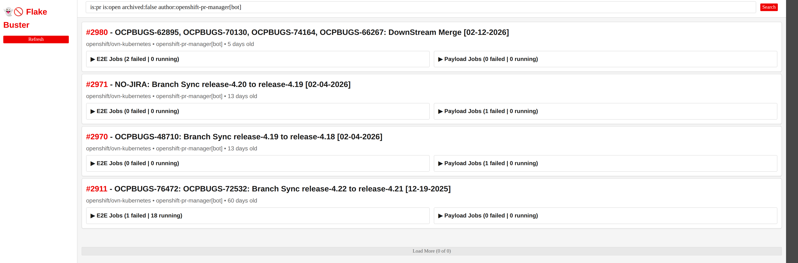

# Flake Buster — PR CI Dashboard

Flake Buster is a Flask dashboard for finding open OpenShift pull requests,
showing failed and running Prow jobs, and posting targeted retest comments.
It can also use Claude Code and the `ci@ai-helpers` plugin to classify repeated
failures as permafails.



## What it does

- Searches pull requests with GitHub's search syntax.
- Discovers failed and running e2e and payload jobs.
- Shows consecutive failures with links to their Prow runs.
- Posts `/test <job>` and `/payload-job <job>` comments.
- Polls manually retested jobs until they start running.
- Optionally auto-retests the first two failures and analyzes later failures.
- Caches analysis results, auto-retest settings, and an audit trail in SQLite.
- Supports local `gh` credentials, per-user GitHub/Google OAuth, and a GitHub
  App bot fallback.

The default search is:

```text
is:pr is:open archived:false author:openshift-pr-manager[bot]
```

## Local quick start

Requirements:

- Python 3.11 or newer
- Bash, `curl`, `jq`, and GNU `awk`
- [GitHub CLI](https://cli.github.com/) authenticated with `gh auth login`
- Claude Code plus `ci@ai-helpers` only if permafail analysis is needed

Install and run:

```bash
git clone https://github.com/jluhrsen/pr-ci-dashboard.git
cd pr-ci-dashboard
python3 -m venv .venv
source .venv/bin/activate
pip install -e .
pr-ci-dashboard
```

Open <http://localhost:5000>.

> Security: the current server listens on `0.0.0.0`, even for local runs, and
> the default local mode uses your ambient `gh` credentials without an
> application login. Use a host firewall and do not run it on an untrusted
> network. [Issue #8](https://github.com/jluhrsen/pr-ci-dashboard/issues/8)
> tracks changing the default to loopback.

Useful options:

```bash
pr-ci-dashboard --search "repo:openshift/ovn-kubernetes"
pr-ci-dashboard --search-override "is:pr is:open label:lgtm"
pr-ci-dashboard --db-path /path/to/dashboard.db
pr-ci-dashboard --port 8080
pr-ci-dashboard --debug
```

`--search` and legacy positional terms append to the default query.
`--search-override` replaces it. `--debug` enables the Werkzeug development
server and must not be used for a shared deployment. `python server.py`
remains as a compatibility entry point.

### Temporary quick run

Review [`run.sh`](run.sh), then run:

```bash
bash <(curl -fsSL https://raw.githubusercontent.com/jluhrsen/pr-ci-dashboard/main/run.sh)
```

The script checks prerequisites, downloads the current `main` branch into
`/tmp`, creates a temporary virtual environment, and removes that checkout on
exit. Analysis cache and auto-retest settings are still persisted in
`~/.local/share/pr-ci-dashboard/dashboard.db`.

Process substitution keeps the terminal connected to the script so its
optional plugin prompt works. A `curl | bash` pipeline does not.

## Permafail analysis

Install the analyzer prerequisites:

```bash
claude plugin marketplace add openshift-eng/ai-helpers
claude plugin install ci@ai-helpers
```

For Vertex AI, configure credentials accepted by Claude Code, for example:

```bash
export CLAUDE_CODE_USE_VERTEX=1
export ANTHROPIC_VERTEX_PROJECT_ID=your-gcp-project
export GOOGLE_APPLICATION_CREDENTIALS=/path/to/service-account.json
```

The API accepts 2–10 consecutive Prow URLs. The analyzer looks for a repeated
test or infrastructure signature, stores results per URL, and marks permafails
with a dumpster-fire icon. Right-click an analyzable job to clear or refresh
its cached verdict. The streaming path currently also stores failed analyses;
[issue #3](https://github.com/jluhrsen/pr-ci-dashboard/issues/3) tracks
preventing those records from being treated as successful non-permafail
verdicts.

Analysis is optional. Search, job discovery, and manual retesting continue to
work when Claude or Vertex credentials are unavailable.

## Auto-retest behavior

Auto-retest is opt-in per PR:

1. A first or second consecutive failure is retested.
2. At three or more consecutive failures, analysis runs before another retest
   when at least two run URLs are available.
3. A confirmed permafail is not retested.
4. Monitoring stops when every remaining failed job is a permafail and no job
   is running.

Auto-retest settings are shared in SQLite, but polling and cooldowns currently
live in each open browser tab. A browser must remain open, and multiple tabs or
users can race and post duplicate comments. Do not enable the same monitor in
a shared deployment until
[issue #2](https://github.com/jluhrsen/pr-ci-dashboard/issues/2) is resolved.

## Authentication modes

| Mode | GitHub operations | Analysis credentials | Intended use |
| --- | --- | --- | --- |
| Local default | Ambient `gh` login or `GH_TOKEN` | Ambient Claude/Vertex configuration | One trusted developer machine |
| Per-user OAuth | GitHub device-flow token | Google OAuth refresh token, converted to transient ADC | Shared dashboard with individual attribution |
| GitHub App bot | User token when connected, otherwise short-lived App installation token | Per-user Google OAuth or ambient credentials | Shared OpenShift team deployment |

OAuth tokens are held in the single server process and expire after an idle
TTL (eight hours by default). They do not survive a restart. Per-user Google
credentials are written to a mode-0600 temporary file only for the Claude
subprocess and then deleted.

See [the multi-user deployment guide](docs/multi-user-deployment.md) for the
configuration and secret model.

## Container image

CI tests every push and pull request. On `main`, it publishes
`quay.io/jluhrsen/pr-ci-dashboard:latest` and a commit-SHA tag when the Quay
secrets are configured.

Build locally with:

```bash
podman build -t pr-ci-dashboard:local .
```

The Containerfile currently:

- uses an OpenShift CI RHEL 9 builder image;
- installs Python 3.11, `gh`, `jq`, Claude Code, and the analyzer plugin;
- runs as UID 1001 with GID 0;
- stores SQLite data at `/data/dashboard.db`;
- bakes public team OAuth/App identifiers and the `redhat.com` hosted-domain
  restriction into the image;
- requires secrets and site-specific Vertex configuration at runtime.

For the team configuration, create a private environment file and optional
GitHub App secret:

```bash
printf 'GOOGLE_OAUTH_CLIENT_SECRET=<secret>\nANTHROPIC_VERTEX_PROJECT_ID=<project>\n' > ~/.config/fb.env
chmod 600 ~/.config/fb.env
podman secret create fb-github-app-key ~/.config/fb-bot-key.pem
podman run -d --name flake-buster \
  -p 127.0.0.1:5000:5000 \
  --env-file ~/.config/fb.env \
  -v fb-data:/data \
  --secret source=fb-github-app-key,type=mount,target=/secrets/github-app/private-key.pem,uid=1001,gid=0,mode=0400 \
  quay.io/jluhrsen/pr-ci-dashboard:latest
```

The App secret is optional. Without it, the baked GitHub device-flow login is
required. The Google client secret enables the baked Google login requirement;
without it, analysis falls back to ambient/mounted credentials if available.
Never put either secret in the image or repository.

Use `127.0.0.1`, not `localhost`, with the shown rootless Podman publish.
Google's authorized redirect URI must exactly match the browser host and port,
including `/api/google/oauth/callback`.

## Kubernetes and OpenShift

The checked-in manifests describe the intended single-replica shape:

- one Flask/gunicorn pod;
- a ReadWriteOnce PVC for SQLite;
- `Recreate` deployment strategy;
- a ClusterIP Service and `/healthz` probes;
- optional Google service-account and GitHub App secrets;
- a RAM-backed `/tmp` for transient user ADC files.

They are not currently a copy-paste deployment: the image name differs from
the image published by CI, a Vertex project placeholder remains, and the
vanilla-Kubernetes `fsGroup: 0` is rejected by OpenShift's restricted SCC.
Follow [issue #5](https://github.com/jluhrsen/pr-ci-dashboard/issues/5) before
using them outside a development namespace.

SQLite and the in-memory OAuth stores require one gunicorn worker and one pod.
Multi-replica deployment needs shared session/coordination storage and a
database designed for concurrent replicas.

## Database and configuration

The default database is:

```text
~/.local/share/pr-ci-dashboard/dashboard.db
```

Override it with `--db-path` or `PR_CI_DASHBOARD_DB`. The schema contains:

- `job_analyses` — cached permafail results and overrides;
- `auto_retest` — enabled PR monitors;
- `audit_log` — retest and analysis actions.

Common environment variables:

| Variable | Purpose |
| --- | --- |
| `DASHBOARD_PORT` | Server port; default `5000` |
| `DASHBOARD_DEBUG` | Enable Werkzeug debug mode |
| `DASHBOARD_SECRET_KEY` | Stable Flask cookie-signing key |
| `DASHBOARD_SECURE_COOKIES` | Mark session cookies Secure behind HTTPS |
| `DASHBOARD_REQUIRE_LOGIN` | Require configured Google login for APIs |
| `DASHBOARD_REQUIRE_GITHUB` | Require configured GitHub login unless App bot mode is active |
| `DASHBOARD_SESSION_TTL_SECONDS` | Idle lifetime for in-memory OAuth sessions |
| `GITHUB_OAUTH_CLIENT_ID` | GitHub OAuth App device-flow client ID |
| `GITHUB_APP_ID` | GitHub App ID |
| `GITHUB_APP_PRIVATE_KEY_FILE` | Mounted App private-key path |
| `GITHUB_APP_ORG` | App installation organization; default `openshift` |
| `GOOGLE_OAUTH_CLIENT_ID` | Google web OAuth client ID |
| `GOOGLE_OAUTH_CLIENT_SECRET` | Google web OAuth client secret |
| `GOOGLE_OAUTH_HOSTED_DOMAIN` | Required Google Workspace domain |
| `PR_CI_DASHBOARD_CLAUDE_WORKDIR` | Working directory for Claude subprocesses |

## Development

```bash
python3 -m venv .venv
source .venv/bin/activate
pip install -e '.[dev]'
pytest -q
node --check pr_ci_dashboard/static/app.js
bash -n run.sh pr_ci_dashboard/scripts/*.sh
```

The test suite is mostly backend/unit coverage; browser behavior is not yet
covered by a JavaScript test harness.

## Project layout

```text
pr_ci_dashboard/
  api/          analysis, job, search, and retest services
  scripts/      packaged Bash job-discovery/retest helpers
  static/       vanilla JavaScript, CSS, and images
  templates/    Flask HTML template
  utils/        auth, database, analyzer, validation, and execution helpers
k8s/            single-replica Kubernetes resources
tests/          pytest suite
```

More documentation:

- [Current architecture](docs/design.md)
- [Multi-user deployment and security model](docs/multi-user-deployment.md)
- [Documentation index and historical notes](docs/README.md)

## License

Apache-2.0. See [LICENSE](LICENSE).
